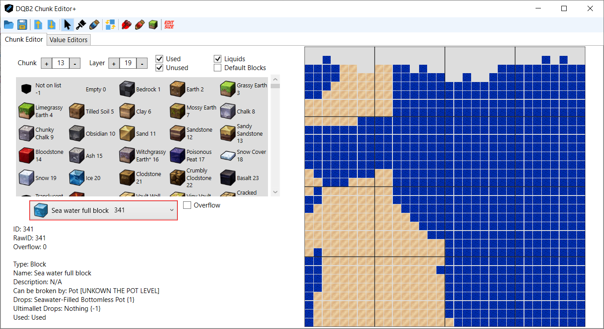

Many thanks to Mugafo (https://github.com/Mugafo/DQB2ChunkEditor) and his work! Without him this fork wouldn't exist. Many many thanks.

And of course to turtle-insect (https://github.com/turtle-insect/DQB2), the one who paved the way in DQB2 technical knowledge.

## DQB2 Chunk Editor Plus

This is my first time uploading to GitHub. I am unsure of the standard procedure. This fork adds more functionality to the original program.
I assume since it hasn't been updated for years that it will not be.

For all undocumented blocks, here is a link with all IDs identified. https://www.tumblr.com/sapphire-rb/751291945137078272/all-of-dqb2s-blocks-with-their-ids

Do not try to set unidentified blocks (the ones that make the selection say '-1 not on list') because I don't know if it will work or not.

**Note: Has not been fully tested yet. ALWAYS BACK UP YOUR SAVE.**

Updated screenshots.

 

Items are still unrecognized. 

**0.2.0:**
- Import and Export buttons for raw hex editing.
- Updated block list with new blocks.
- Changed the way the blocks display in the map for a better visual interface (In-game textures instead of block icons).
- Blocks seem to overflow at index 2048. Added functionality to read and insert blocks with their normal and overflowed indices.

**0.2.1:**
- Added a 'flatten island' option (Turtle's one wasn't working for me and I needed it for testing)
- Added a Magic Pencil tool that will select a whole area in the current layer. By choosing a new block the entire area will be set to that block.
- Added a 'Replace block' tool that will replace every instance of that block in the map for a different one. If there is a selection active with the Pencil it will only affect the selected area.
- Changed a water block that seemed to have the wrong name (It was *too* obviously wrong to ignore)
- Changed the way the chunk number is fetched.

**0.2.2:**
- Completed the whole block list from ID 0 to 2047. Added colors (Still missing images)
- New info added: What items do the blocks drop and the hammer requirement of the blocks. 'Used' property added as well (Not accurate)
- Fixed oversight on the way the chunk number is fetched when importing a file

**0.2.3:**
- Added placeholder filter option to filter blocks by name (Thank goodness)
- Added support for editing Gratitude Points, Time and Weather (Not fully tested, weather is not documented yet)

Screenshots of 2.1:

 

Screenshot of 2.2:

**Features to add:**
- Optimize images from the dropdown menu (lags a little).
- Better filtering for the dropdown menu.
- Decorative items.
- Fill bucket mayhaps.
- Automatic backup.

**External info to add:**
- Colored block images are not implemented yet.
- Mapping of all chunks in each island (They are really big.)

Main branch text below.

## DQB2 Chunk Editor 

Dragon Quest Builders 2 Map Chunk Editor based on the map flattener from https://github.com/turtle-insect/DQB2

### Requirements
[.NET 6 Runtime](https://dotnet.microsoft.com/en-us/download/dotnet/6.0/runtime)

### Save Data

Steam save files should be located in `C:\Users\<user>\Documents\My Games\DRAGON QUEST BUILDERS II\Steam\<steam id>\SD\`

B00, B01, B02 are the corresponding save slots for the data.

STGDAT01.BIN is the Isle of Awakening map data.

Backups are not made when editing, so make sure to keep a backup of the save folders.

### Information

Able to edit all chunks and layers. Some issues with unmapped blocks due to duplication. Still need to add color and block shapes as well. I have the ID's but still need to add functionality for it.

"Items" are more difficult than simple blocks and I am still researching the data structure. Looks like there are a lot of different things that go into those, placement direction, shadows, block tile effects.

